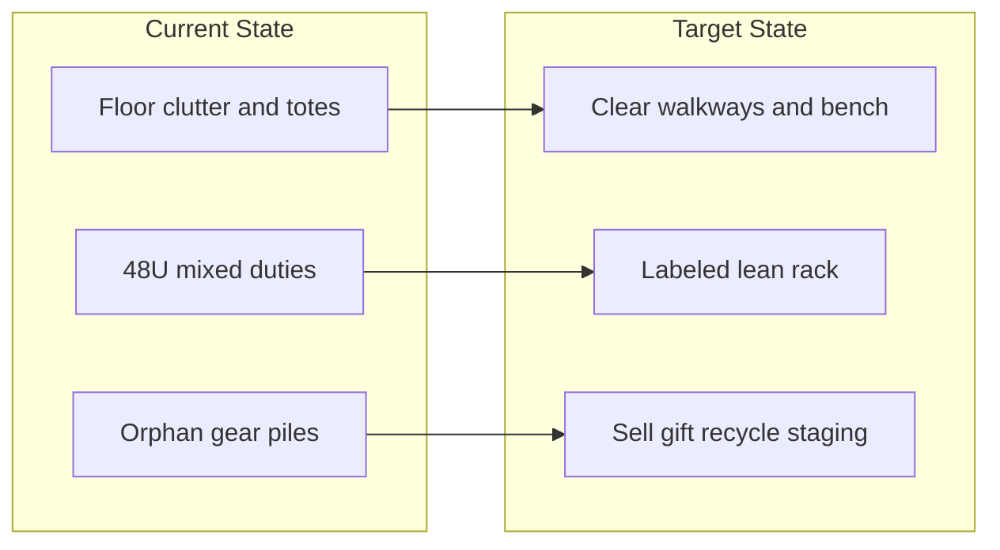

# Reclaim the Rack: A Father’s Lab Vision

You do not have a technology problem. You have an **identity that outgrew its container**. The rack was built by a man with surplus nights, surplus curiosity, and a workshop that could absorb chaos. Fatherhood removed the surplus. The gear stayed. Guilt filled the gap.

This plan treats that honestly: **downsize until the room can breathe, then rebuild meaning on purpose — not nostalgia.**

---

## The uncomfortable diagnosis

A neglected 48U rack with 100TB of Linux ISOs and “significant compute” usually means three things stacked on top of each other:

1. **Infrastructure** — things that still do work (backups, media, VMs, automation).
2. **Archive** — things kept “just in case” (ISO hoards, cold hardware, half-finished clusters).
3. **Altar** — proof you are still the technologist/gamer/builder you were before the baby.

Only (1) deserves floor space and electricity by default. (2) gets one deliberate decision. (3) must be renamed or dismantled, because altars that demand weekly offerings you cannot pay become shrines of shame.

**Brave default:** Assume most of the mess around the rack is altar + archive. Plan as if 60–80% of the perimeter clutter and a large fraction of powered gear will leave the room within 90 days.

---

## The new purpose (one sentence)

**This room exists to run a small number of reliable household and craft systems with low drama — and to leave enough clear space that you can walk in without negotiating with who you used to be.**

If a machine cannot be named in that sentence, it is a candidate for exit.

### Four allowed missions (pick only what is true)

| Mission | Meaning | Father-fit test |
|--------|---------|-----------------|
| **Household utility** | Backups, photos, media, DNS/VPN, home automation | Partner would notice if it died |
| **Craft bench** | One active learning/build project at a time | You touched it in the last 30 days |
| **Play** | Games, LAN, creative compute — scheduled, not ambient | It has a start/stop ritual, not 24/7 identity |
| **Legacy teaching** | Eventually show a child how systems work | It is simple enough to explain in 10 minutes |

Everything else is **debt wearing a heatsink**.

**Default stack to aim for:** one quiet primary server (or small cluster), one storage node sized to *actual* retention policy (not “because 100TB sounds cool”), networking that is labeled and boring, zero floor sprawl.

---

## Reclaim the space (physical vision)

Treat the **room**, not the rack, as the product.

**Physical rules:**

- **Clear the perimeter first.** Nothing lives on the floor within arm’s reach of the rack except a single labeled staging tote (“decide this month”).
- **One work surface.** A small clean bench for hands-on work; when the project ends, the bench empties.
- **Rack as appliance, not workshop.** Front clear, cables managed, blanking panels where gear is gone, airflow unblocked. A tidy rack that is half empty is a win, not a failure.
- **Noise/heat as family constraints.** If the room fights sleep, play, or shared space, the gear loses — not the family.
- **Visual calm is part of the redesign.** Labels, consistent cable color, inventory sheet on the door. Order is how meaning becomes maintainable.

---

## Rethink the technology (keep / kill / transform)

### 1. Workload audit (one evening)

Write every service that is actually running. For each: last real use, who depends on it, hours/month to keep it alive, replacement cost if you outsourced or deleted it.

Kill anything with no dependent and no use in 90 days.

### 2. The ISO / archive truth

100TB of Linux ISOs is almost never a mission; it is a collection. Keep a **curated mirror** of what you rebuild from (current LTS + a few tools), document the rest, then **delete or cold-archive offsite** what you will not re-download in an afternoon. Disk is cheap; **attention and floor space are not**.

### 3. Compute power

Idle GPU/CPU farms are expensive hobbies. Keep compute that has a **named job** (transcoding, homelab learning, one game server). Power off or sell the rest. “I might train a model” is not a job.

### 4. Older gear — three exits only

| Exit | When |
|------|------|
| **Sell** | Still valuable, you will not use in 6 months |
| **Gift** | Useful to a student, nonprofit, friend — identity continues as generosity |
| **Recycle / e-waste** | Dead weight; keeping it “for parts” without a parts bin and list is lying |

No fourth category called “maybe later” on the floor. Maybe-later lives in a single tote with a date; after that date it exits automatically.

---

## Deeper meaning (what maintenance is for now)

The old meaning was: *I am the kind of person who can run serious infrastructure.*

The new meaning is: **stewardship under constraint.**

That is a harder, adult craft:

- Reliability over novelty
- Documentation over folklore
- Hours that fit nap windows over weekend-long rewires
- Teaching potential over impressiveness
- Systems that survive your neglect for a week without drama

**Ritual (default):** 45–90 minutes every other weekend — check backups, update what matters, clear the staging tote, touch one intentional project *or* stop. If you skip two cycles, shrink the stack again. The stack must fit the life, not the reverse.

A half-empty, documented, quiet rack you can explain to your kid someday is richer than a mad workshop that owns you.

---

## 90-day sequence

**Days 1–14 — Face it**
- Photo the room (before).
- Inventory powered gear + services.
- Create three zones: Keep / Decide / Exit.
- Clear floor clutter into Decide/Exit only.

**Days 15–45 — Cut**
- Power down non-essential hosts.
- Migrate must-keep services onto the smallest reliable footprint.
- Sell/gift first wave of redundant hardware.
- Collapse ISO archive to policy-sized storage.

**Days 46–90 — Rebuild meaning**
- Label, cable, document (one page: what runs, where, how to restore).
- Define the biweekly stewardship ritual on the calendar.
- Choose **one** craft or play project for the next quarter — only one.
- After photo; write a short “Lab Charter” (missions allowed, max power budget, max weekly hours, exit rules).

---

## What success looks like

- You can walk around the rack without kicking totes.
- You can name every powered machine’s job in one breath.
- The room feels like a **utility + small atelier**, not a crime scene of unfinished selves.
- Maintenance is a short appointment, not a moral failure when you miss a month.
- Older gear has left as cash, gifts, or recycling — not as guilt.

---

## Note on courage

The bravest upgrade is not a new chassis. It is admitting that **some of this gear was a monument to a pre-father life**, and monuments do not need UPS power. Keep the craft. Release the museum.
